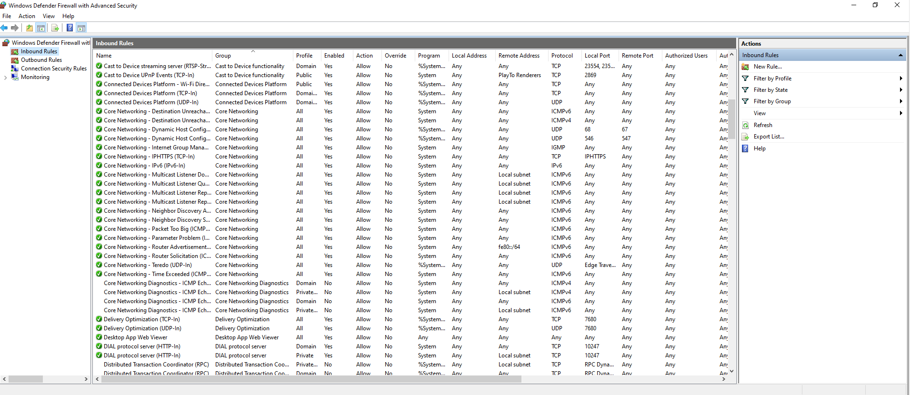

# Cyber Internship – Task 4: Firewall Setup & Testing

## Objective
Configure and test basic firewall rules to allow or block network traffic.

## Tools Used
- **Windows Firewall with Advanced Security**
- Command Prompt (`telnet`) for testing
- UFW (Linux equivalent commands documented in `notes/methodology.md`)

## Methodology
1. Viewed existing firewall rules.
2. Created inbound rule to block TCP port 23 (Telnet).
3. Tested the block using `telnet`.
4. Documented Linux equivalent commands for UFW.
5. Removed the test rule to restore original state.

## Screenshots
| Step | Image |
|------|-------|
| Initial Rules |  |
| Block Telnet Rule |  |
| Testing Block |  |
| Rule Removal |  |

## Key Learnings
- Difference between **inbound** and **outbound** rules.
- Why blocking insecure ports (e.g., Telnet) is important.
- Linux UFW makes firewall rule management simple with commands like:
  ```bash
  sudo ufw allow 22/tcp
  sudo ufw deny 23/tcp
  sudo ufw status
